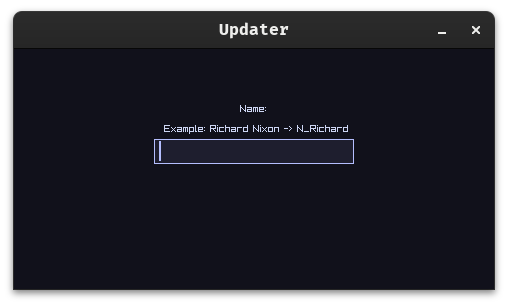

# Simple Update Utility
- Updates the NixOS system from user input.
- Uses my NixOS flake, which is customised for the given user.

## Special Thanks
- [RayLib](https://github.com/raysan5/raylib)
- [RayGUI](https://github.com/raysan5/raygui)
- [Odinlang](https://github.com/odin-lang/Odin)
